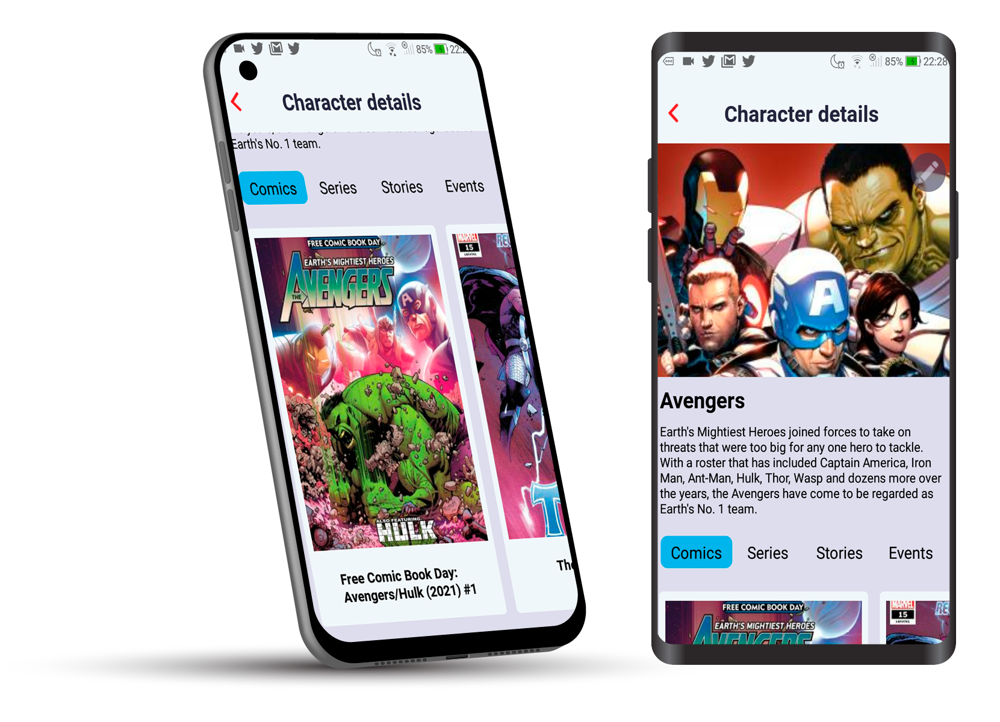
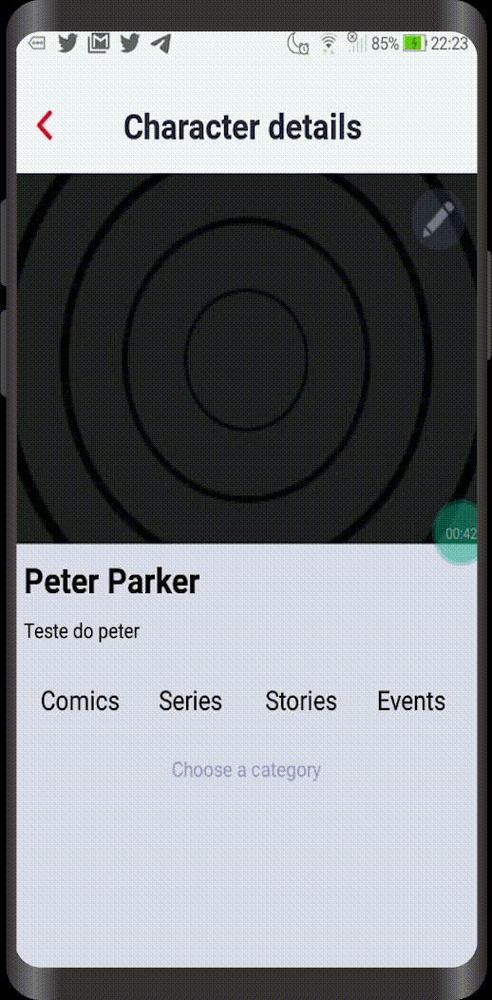

  

  

     

<h1 align="center">
    
</h1>

 

## 🧪 Technologies

This project was developed with the following technologies:

- [React Native](https://reactnative.dev/)
- [React Redux](https://react-redux.js.org/)
- [React Persist](https://github.com/rt2zz/redux-persist)
- [Styled Components](https://styled-components.com/)
- [React Hook Form](https://react-hook-form.com/pt/)
- [React Navigation](https://reactnavigation.org/)
- [Axios](https://github.com/axios/axios)

## 💻 Project

The WikiMarvel is a five days project proposed by a esnterprise of technology to challange candidates's skills.

## 🖌 More images of the project
- First initialization

  

- Edit character data

  

- Edit character data

  

